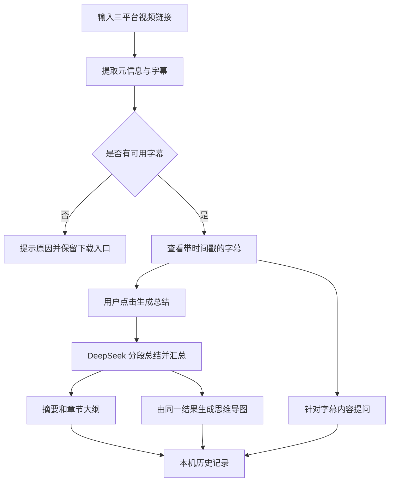

# 《万能视频下载器》AI 视频学习功能方案

日期：2026-10-04。状态：**用户以“开始开发”批准实施，A/B/C/D 开发、自动验证与两条短视频的真实 DeepSeek 验证已完成；长视频内容质量与用户验收待完成。**

依据：[项目完成总结](PROJECT_SUMMARY.md)、[竞品调研](AI_VIDEO_SUMMARY_COMPETITOR_RESEARCH.md)、当前 `frontend` / `backend` 源码，以及本轮用户确认。本文保留已批准的设计依据；实施结果与证据边界见 [测试与验收报告](AI_VIDEO_SUMMARY_TEST_REPORT.md)。

2026-10-06 后续扩展：用户确认视频问答采用 SSE 流式展示，保留后台任务与最终引用校验；页面刷新/切换后可接回同一任务。本文的首版完整回答设计为历史方案，当前实现详见 [SSE 扩展方案](AI_QA_SSE_PLAN.md) 与 [专项测试报告](AI_QA_SSE_TEST_REPORT.md)。摘要流程继续保持原实现。

随后用户要求摘要生成也采用 SSE，已将传输与当前阶段草稿展示扩展到每个分段/汇总请求，保留原缓存、汇总与校验保存流程；当前行为与验证见 [摘要 SSE 报告](AI_SUMMARY_SSE_TEST_REPORT.md)。

2026-10-06 根据用户长视频反馈修复“草稿生成一半撤回”：分段和汇总初始输出额度均为 4,096 tokens，明确达到长度上限时的一次修复提高到 8,192；页面保留此前分段及修复前草稿，分别标注状态。下文 2,048-token 分段预算为首版历史设计，问答仍保持 2,048。证据与当前验收见 [修复报告](SUMMARY_STREAM_RESET_FIX.md)。

## 1. 已确认范围

| 项目 | 用户确认 |
| --- | --- |
| 首版平台 | B 站、抖音、YouTube，处理单个视频 |
| A：视频总结 | P0 核心功能，帮助快速理解长视频的大纲和知识要点 |
| B：字幕/转录文本 | 展示原文与时间戳 |
| C：思维导图 | 本次首版实现可视化 |
| D：AI 问答 | 本次首版实现针对视频内容的提问 |
| 模型服务 | DeepSeek 官方 API |
| 内容来源 | 优先由 yt-dlp 获取平台字幕 |
| 无字幕处理 | 提示暂不能总结，保留视频下载；语音转录方案后续决定 |
| 使用场景 | 个人本机使用 |
| 保存方式 | 字幕、摘要、导图和问答保存在本机，刷新和重启后可查看，可手动删除 |

字幕是 A、C、D 的共同前提。三平台均进入首版适配和测试范围，但仅当成功获得可用字幕时提供总结、导图和问答；不能以“视频能下载”推定“视频能总结”。首版不增加语音识别、字幕文件导入、画面识别或第三方总结服务。

随方案批准实施的默认行为：**中文摘要和中文回答、字幕保留原语言、最长 2 小时、独立学习工作区、引用优先定位站内原文、单机 SQLite 保存**。2 小时是首版产品边界，并非 DeepSeek 的模型限制。

## 2. 项目分析与接入原则

已核对现有前后端核心流程、平台适配、依赖、测试及验收文档。当前下载闭环为“解析 → 选格式 → 准备文件 → 保存”；新增学习流程与它并行。

| 当前实现及依据 | 对新增功能的影响 |
| --- | --- |
| [视频解析服务](../backend/app/video_service.py) 返回标题、封面、时长和格式；[ParseResponse](../backend/app/schemas.py) 没有字幕和视频 ID | 学习模块独立提取来源 ID、分 P 标识和字幕，不把临时媒体地址当内容来源 |
| B 站、YouTube 走 yt-dlp；[抖音模块](../backend/app/douyin.py) 走公开移动分享页 | 保留抖音下载通道；为字幕另建 yt-dlp 适配，不能替换已验收的下载通道 |
| 下载任务仅在内存保存，从创建起 2 小时过期 | 学习记录使用独立数据库，生命周期与下载文件分开；不能直接复用下载任务字典 |
| 自动/直链下载可能只返回 302，后端没有媒体文件 | 总结直接依赖字幕，不要求先下载完整视频或高画质文件 |
| yt-dlp 浏览器 Cookie、代理和 PO Token 配置目前仅用于 YouTube | 学习流程可复用显式配置的 YouTube 会话；B 站、抖音不会因此自动读取浏览器登录态 |
| [主页面](../frontend/src/App.vue) 是固定高度首页，结果放在弹窗 | 长篇摘要、原文、导图和聊天使用可滚动的独立工作区，不全部塞入现有下载弹窗 |
| [API 主入口](../backend/app/main.py) 最后挂载前端静态目录 | 新 API 路由需注册在静态挂载前；继续兼容当前开发代理和单进程启动 |
| 当前依赖包含 httpx，没有 AI SDK、数据库或 `.env` 自动加载 | DeepSeek 可用现有 httpx 接入；SQLite 使用 Python 标准库；明确配置读取方式 |

新增 API 与服务单独组织，必要时抽取现有安全配置辅助函数。现有下载请求/响应字段、格式选择、抖音 MP4 校验和音视频合并契约保持兼容，使用既有测试验证。

## 3. 三平台字幕获取

本机安装版本为 **yt-dlp 2026.08.19**。以下是设计时的源码能力核对；实施后真实样例已验证 B 站与 YouTube 字幕成功，抖音受访问限制，详见测试报告。

| 平台 | 拟议获取方法 | 已核对的限制 |
| --- | --- | --- |
| B 站 | yt-dlp 获取字幕，接收其内联 SRT 或字幕资源；保留 BV/AV、CID/分 P 信息 | 当前提取器会返回 `danmaku` XML，必须排除弹幕；可能报告字幕需登录；其 `subtitles` 字段不一定都为人工字幕 |
| YouTube | 同时检查 `subtitles` 与 `automatic_captions`，优先人工轨，必要时使用自动字幕 | 字幕和视频可能受登录、地区、网络、限流影响；避免优先选到自动翻译轨；复用已显式配置的本机会话 |
| 抖音 | 已支持的分享链接先安全解析作品 ID，再构造标准视频链接交给 yt-dlp 探测字幕 | 当前 DouyinIE 依赖详情接口，接口无有效数据时可能要求 fresh cookies；自研下载成功不能证明此接口或字幕可用 |

能力依据：[B 站提取器固定版本](https://github.com/yt-dlp/yt-dlp/blob/2026.08.19/yt_dlp/extractor/bilibili.py)、[抖音提取器固定版本](https://github.com/yt-dlp/yt-dlp/blob/2026.08.19/yt_dlp/extractor/tiktok.py)、[yt-dlp 官方说明](https://github.com/yt-dlp/yt-dlp)。

拟议处理规则：

1. 只接受三平台的单视频链接，校验真实主机名与 URL，拒绝播放列表、直播、图集及非法地址。B 站分 P 与 YouTube 视频 ID 纳入来源身份，不能将不同分集的字幕混用。
2. 提取字幕时跳过媒体下载，同时启用人工字幕和自动字幕发现。优先顺序为：中文字幕人工轨 → 中文字幕自动轨 → 原语言人工轨 → 原语言自动轨 → 其他可用轨。未知来源轨明确标记，不伪称人工。
3. 提供可用语言轨选择；默认自动选择，记录语言和人工/自动/未知来源。更换轨道建立独立分析版本，避免旧摘要和新字幕混用。
4. 处理 SRT、VTT，以及实际返回的 B 站/YouTube/抖音字幕 JSON。只实现已取得明确结构的 JSON 适配；未知格式返回 `SUBTITLE_FORMAT_UNSUPPORTED`，不猜测字段。
5. 归一化为 `{id, start, end, text}`，时间使用秒，保留原时间轴；清除字幕样式和无效空片段，处理 YouTube 滚动字幕的重叠重复。原文展示不让 AI 改写。
6. 区分 `NO_CAPTIONS`、`CAPTIONS_ACCESS_REQUIRED`、`CAPTIONS_FETCH_FAILED`、`EMPTY_TRANSCRIPT`、`SUBTITLE_FORMAT_UNSUPPORTED`。只有元数据/轨道探测成功且没有可用轨时，才判为没有字幕；网络或鉴权错误不能归为无字幕。
7. 只有弹幕、标题、简介或烧录在画面里的文字，均不作为可用字幕。无字幕/受阻时显示对应原因，并保留“下载视频”入口；不调用 DeepSeek 生成猜测摘要。
8. 应用自行请求字幕 URL 时校验地址和每次跳转、限制响应体并设超时；不将平台 Cookie 转发给 DeepSeek。yt-dlp 内部请求沿用其提取器边界，现有 URL 校验不能被描述为覆盖了其全部网络跳转。

首版默认匿名获取 B 站与抖音字幕。实施时已报告登录阻碍，用户明确批准新增字幕专用 Firefox 会话配置，并在 Firefox 登录了两平台。新增 `VIDEO_LEARNING_FIREFOX_SESSION=1` / `start-local.ps1 -UseFirefoxSubtitleSession` 显式开启，可用 `VIDEO_LEARNING_FIREFOX_PROFILE` 指定配置目录。只作用于 B 站/抖音字幕获取，不改变下载模块或 YouTube 的原有配置；默认关闭，不保存或向 DeepSeek 发送 Cookie。

## 4. 用户流程与页面

拟议增加“视频下载 / 视频学习”导航，保留现有下载首页；从已解析视频也能进入学习工作区。首次进入学习流程不强制下载视频。



工作区布局：顶部为标题、平台、时长、字幕语言/来源、打开原视频和下载入口；主体以“摘要 / 字幕 / 思维导图 / 问答”四个标签页组织。桌面可显示历史侧栏，窄屏改为可展开列表，主体可以正常滚动。

| 功能 | 首版行为 |
| --- | --- |
| 摘要 A | 一句话概览、简明总览、章节大纲、每章知识要点；原文确有方法/例子时保留；每章与核心要点附原文引用 |
| 字幕 B | 时间戳、原文、语言和来源；可搜索并定位片段，大量片段分页加载；不展示伪造的转录或摘要代替原文 |
| 导图 C | “视频主题 → 章节 → 核心要点”三级为主；支持展开/折叠、缩放、拖动、适配视图；节点引用定位字幕；窄屏提供树形列表 |
| 问答 D | 仅针对当前视频的字幕回答；展示引用片段与时间戳；支持连续追问、清空当前对话；证据不足明确说明 |
| 结果复用 | 可查看历史、重新打开、删除记录；复制/导出摘要 Markdown 与字幕 SRT，作为轻量保存入口 |
| 进度和失败 | 展示真实阶段及分段完成数；缺少字幕、密钥未配置、余额不足、限流、网络失败有不同提示和适用的重试入口 |

时间戳首先用于定位工作区内的字幕原文，保证三平台一致可用。提供“打开原视频”；只有经过实际验证的平台才生成站外时间点链接，抖音不承诺站外精确跳转。首版不加入站内视频播放器、自动同步播放或字幕编辑器。

字幕来源/缺失片段会影响结果。页面说明“根据所获字幕整理，未分析视频画面”；不把字幕的空白间隔自动算成漏字，也不伪造“完整准确率”。

## 5. DeepSeek 接入与生成策略

### 5.1 官方接口和推荐默认值

本轮查阅的官方文档列出 `deepseek-flash` 与 `deepseek-v4-pro`，均支持 1M 上下文和 JSON 输出。随方案批准实施的默认值为 **`deepseek-flash`、非思考模式**，模型名保留后端配置。[官方模型文档](https://api-docs.deepseek.com/quick_start/pricing/)、[思考模式](https://api-docs.deepseek.com/guides/thinking_mode/)

后端用 httpx 调用 `https://api.deepseek.com/chat/completions`，使用 Bearer API Key。发送字幕文本、当前问题和必要的对话上下文；首版不发送视频/音频文件、浏览器 Cookie 或本地文件路径。

JSON 输出显式设置 `response_format: {type: "json_object"}`，提示词给出 JSON 结构和字段约束。服务端仍需检查空内容、结束原因、Pydantic 结构及引用有效性；合法 JSON 不等于业务字段正确。官方文档也提醒空内容和输出截断情况。[JSON 输出说明](https://api-docs.deepseek.com/guides/json_mode/)、[请求/响应定义](https://api-docs.deepseek.com/api/create-chat-completion/)

配置为 `DEEPSEEK_API_KEY`、`DEEPSEEK_MODEL`、请求超时与应用处理上限。实施中用户要求创建 `.env`，已增加后端启动时读取项目根目录 `.env` 的 AI/学习配置，进程环境变量优先；不读取示例文件，也不改变 `YTDLP_*` 下载配置。提供无真实值的 `.env.example`；实际 `.env` 被 Git 忽略。另可通过终端隐藏输入配置。密钥不进入前端构建或学习数据库。

### 5.2 摘要与导图共用结构

```text
summary_version
├─ overview：一句话概览、简明总览
├─ chapters[]：标题、概述、points[]、cue_ids[]
│  └─ point：知识点、可选方法/例子、cue_ids[]
└─ provenance：字幕版本、语言、来源、模型、提示词版本、生成时间、用量
```

模型只引用输入中已有的 `cue_ids`，后端从字幕记录计算引用时间，防止模型编造分钟数。引用校验能排除无效 ID 和越界时间；语义是否准确仍由内容质量测试检查，不能声称因此消除了幻觉。

导图由已验证的章节/要点结构确定性生成，使用 Vue + SVG 呈现，避免再付费请求一份可能与摘要冲突的内容。节点文本按普通文本处理，不执行模型返回的 HTML、脚本或图表代码；建议限制深度 4 层和显示节点 100 个，超出时折叠并可展开到对应章节详情。

### 5.3 长视频：分段整理，再合并

以字幕片段为单位划分连续段，每段约 12,000 文本字符，边界适当保留邻近片段；不在句子中间硬切，记录每段覆盖的 cue ID。该值为可调初值，开发测试后按质量和延迟调整。

1. 短文本直接生成；长文本先对所有分段生成中间结果。
2. 中间结果保留章节点、关键细节及 cue 引用，持久化到本机。
3. 全部分段成功后汇总去重，构成整体大纲与知识要点；汇总输入过长时继续分层合并，不静默丢弃后半部分。
4. 任一分段失败不能把不完整结果标记为全片完成；保存成功分段，用户重试时复用，避免全部重做。
5. 摘要和导图共用同一版本；更换字幕或重新生成产生新版本，失败时仍可查看原有成功结果。

字幕只有部分可用时明确展示实际片段范围和限制，摘要限于收到的内容。首版不声称恢复平台没有提供的内容，也不解析口播未讲清楚的课件/图表细节。

### 5.4 问答：直接使用原字幕依据

针对本次个人本机、最长 2 小时的范围，首版优先把**完整有效字幕**连同片段 ID 送入模型，而非只给它摘要；这样具体细节不会因为摘要压缩而直接丢失。当前官方上下文容量允许采用这一路线，是否满足实际长度仍由请求预算检查。[上下文容量](https://api-docs.deepseek.com/quick_start/pricing/)

带入最近 5 轮对话用于理解追问，字幕仍作为事实依据，历史 AI 回答不能被当成视频证据。问题建议上限 2,000 字符，单次回答输出上限 2,048 tokens。问题或历史超预算时明确拒绝/提示清空历史，不静默截掉字幕或改用摘要。

回答采用“回答内容 + cue 引用 + 依据是否足够”的结构，引用点击定位原文。没有相关依据时答“这段视频的可用字幕没有提供足够信息”，需要画面才能判断时说明限制；不联网补知识后冒充视频结论。

每次追问都会重新发送上下文并产生 API 用量。首版不增加嵌入模型、向量数据库或跨视频检索；更长视频/更多用户需要时再评估检索方案。

### 5.5 费用、故障与任务控制

建议的应用初始边界：最长 120 分钟、有效字幕文本最多 120,000 字符、单字幕资源最多 5 MiB、提交模型的序列化请求最多 700 KiB、AI 同时执行最多 2 个请求、等待任务队列最多 10 个。请求预检还需给输出预留容量；700 KiB 是保守的传输大小控制，不声称等于精确 token 数。达到上限明确提示，不只总结开头。

输出限制建议为分段摘要 2,048 tokens、最终摘要 4,096 tokens、回答 2,048 tokens；连接超时 10 秒，单次模型请求最多 180 秒，整项摘要最多 15 分钟。超时限度先作为验收候选，不承诺固定完成速度。

读取真实 `usage`，记录输入/输出和可用缓存用量。价格随模型和时段变化，使用官方账单为准，首版不承诺单视频固定费用。[官方计费说明](https://api-docs.deepseek.com/quick_start/pricing/)

错误分为密钥未配置/无效、余额不足、限流、连接失败、上游故障和无效模型输出。400/401/402/422 不自动重试；明确的 429/5xx 最多退避重试 2 次。响应超时可能已有计费，不自动无限重发；结构校验失败最多修复 1 次，仍失败就交给用户重试。[官方错误码](https://api-docs.deepseek.com/quick_start/error_codes/)

重复点击与轮询不会创建新的生成任务；用户明确“重新生成”或“重试”才触发对应操作。以字幕哈希、模型、提示词版本和生成设置识别可复用结果，不跨字幕版本复用。

## 6. 后端组织、保存与 API 草案

建议新增模块：

| 模块 | 职责 |
| --- | --- |
| `analysis_routes.py` / `analysis_schemas.py` | 学习 API 和请求/响应契约 |
| `subtitle_service.py` | 三平台字幕发现、获取、来源标记与格式归一化 |
| `deepseek_client.py` | 官方 API 配置、超时、错误分类、用量 |
| `summary_service.py` / `chat_service.py` | 分段/汇总、JSON 与引用校验、问答上下文 |
| `analysis_store.py` | SQLite 事务、字幕和结果版本、历史、删除 |
| `analysis_jobs.py` | 有界后台执行、持久化状态、去重、失败重试 |

SQLite 建议位于 `backend/data/learning.sqlite3`，运行数据目录加入 `.gitignore`，不挂载为静态目录。保存视频身份、稳定来源链接、语言轨、字幕片段、分段摘要、最终结构、问答记录和作业状态；不保存平台 Cookie、密钥或临时签名媒体地址。封面需要重新注册现有短时代理，不把过期 token 当持久化资源。

数据库使用版本化建表/升级和短事务；模型请求时不持有数据库写锁。服务启动将此前仍在执行的作业标为 `interrupted`，提示用户手动继续，不自动重新调用付费接口。完成记录没有下载任务的两小时有效期，保存到用户删除为止。

删除记录时先停用关联作业，再删除字幕、结果、对话与中间数据；异步返回的结果不能重新插入已删除的记录。SQLite 文件和 WAL 需正确处理，此处“删除”指应用层数据移除，不承诺磁盘介质安全擦除。

| 拟议 API | 行为 |
| --- | --- |
| `GET /api/v1/ai/config` | 只返回是否已配置、模型与应用边界，绝不返回密钥 |
| `POST /api/v1/analyses` | 接收 URL/字幕语言偏好，创建字幕获取作业并返回 202；不自动调用 AI |
| `GET /api/v1/analyses` | 分页查询本机历史 |
| `GET /api/v1/analyses/{id}` | 元信息、字幕/摘要状态、作业阶段和失败原因 |
| `GET /api/v1/analyses/{id}/transcript` | 分页/搜索字幕及时间戳；跳转按 cue ID 定位 |
| `POST /api/v1/analyses/{id}/summary` | 字幕有效且配置正常才创建生成任务；同时生成导图结构 |
| `GET /api/v1/analyses/{id}/summary` | 返回成功的摘要版本、导图结构、生成信息和状态 |
| `POST /api/v1/analyses/{id}/chat` | 接收问题和客户端请求 ID，返回 202 与消息/作业 ID，避免重发重复计费 |
| `GET /api/v1/analyses/{id}/messages` | 查询当前视频对话及回答状态 |
| `DELETE /api/v1/analyses/{id}/messages` | 清空该视频对话 |
| `GET /api/v1/analyses/{id}/export` | 导出本机摘要 Markdown 或字幕 SRT |
| `DELETE /api/v1/analyses/{id}` | 删除学习记录及关联数据 |

资源状态与执行阶段分开：字幕 `pending / fetching / ready / unavailable / failed`；摘要 `idle / queued / processing / ready / failed / interrupted`；阶段描述为“获取字幕 / 第 N 段总结 / 汇总”。任务状态按真实事件更新，不以定时器模拟百分比。

先使用有界的进程内执行器 + SQLite 状态，不加入 Redis/Celery；服务重启可以恢复记录，未完成任务需人工点重试。前端轮询采用可取消请求，切换记录停止旧轮询；恢复页面从数据库查询，不依赖之前的 Vue 内存。问答首版先返回验证后的完整答案，不增加流式半成品渲染。

保持后端默认监听 `127.0.0.1`，API 仅服务本机；为新增请求方法更新开发 CORS，限定允许来源。对会触发费用或删除数据的学习 API 检查浏览器 Origin，避免其他网页替用户发起操作。公开 GitHub 仓库只保存源码、示例配置与文档，运行记录不提交。

## 7. 分步骤开发与检查点

**已收到用户“开始开发”的实施确认。** 按以下阶段完成开发及自动验证；新增的字幕专用 Firefox 会话也已经单独人工确认。A、B、C、D 均已实现，真实模型效果与人工验收仍待完成。

| 阶段 | 实现内容 | 验证和可验收产物 |
| --- | --- | --- |
| 1：字幕与本机记录 | SQLite、平台字幕适配、时间轴归一化、状态 API、字幕页与历史/删除 | 三平台成功/受阻/无字幕区分；时间轴和隔离测试；无需 API Key 可展示真实字幕 |
| 2：摘要闭环 | DeepSeek 客户端、结构校验、分段/汇总、生成/重试、摘要页 | 原文引用、后半段知识覆盖、模型故障分类、缓存去重测试；用假响应先验证流程 |
| 3：思维导图 | 由摘要结构生成 SVG 树、展开折叠、缩放拖动、节点定位、窄屏列表 | 与摘要同源、长节点文本、非法字符、大量节点、键盘操作检查 |
| 4：视频问答 | 完整字幕上下文、连续追问、证据引用、问答保存和清空 | 细节问答、上下文追问、超预算、证据不足与提示注入测试 |
| 5：回归与人工验收 | 本机配置说明、真实视频样例、下载回归、最终文档更新 | 自动测试结果、构建结果、真实样例和限制报告；提供用户操作步骤及待验收清单 |

真实 API 验证需要用户在本机配置可用密钥/余额；没有密钥时完成可独立推进的开发和模拟验证，真实生成准确性与时延保留为待验证，不能以模拟测试替代。开发完成后再按用户验收反馈调整，不提前宣称功能已验收。

## 8. 测试计划与验收标准

本节保留批准实施的测试要求。实施结果为后端 **142 项通过**（既有 80 + 新增 62）、前端类型与生产构建通过、13 项模拟浏览器流程通过，B 站/YouTube 真实字幕及 DeepSeek 摘要成功、8 项真实问答检查通过；长视频质量仍待验收，证据见测试报告。

### 8.1 自动验证

- 字幕：SRT/VTT 与平台 JSON、B 站仅弹幕、不同语言/自动轨、空内容、滚动重复、非法时间、时长超限、分 P 隔离、字幕响应过大、网络/会话错误。
- 模型：正常与畸形 JSON、空输出、输出截断、错误 cue ID、400/401/402/422/429/5xx、超时、修复/重试次数与用量记录。
- 长视频：最后一段含独有知识点的固定样例，验证分段和汇总没有跳过该段；失败片段不影响已完成片段缓存，未完全成功不能标记全片完成。
- 数据/作业：重复提交、防止重复计费、刷新恢复、重启后中断状态、版本切换、数据库写入冲突、删除进行中记录后迟到结果不复活。
- 问答：只能引用当前字幕；历史回答不成为事实来源；文本含“忽略前面的指令”等内容时仍作为视频数据；无依据明确说明。
- 回归：现有后端下载测试全通过；前端类型检查和构建通过；新增契约补充有意义的测试，不只验证界面文字。

### 8.2 真实样例与界面检查

三平台各选择至少 1 条可访问、有可提取字幕的公开视频，以及 1 条无可用字幕/获取受阻的链接；另覆盖一条 60～120 分钟教学/访谈视频、一个 B 站分 P、一个 YouTube 自动字幕样例。样例可重叠。若抖音始终无法获取字幕，要记录为平台字幕能力未验证或受阻，不能用模拟响应算三平台成功。

每次真实验证记录平台、链接、日期、网络/会话配置、字幕语言/来源、时长、处理结果、调用用量及失败分类；不记录 Cookie 和密钥。内容质量需要由人工参考要点与字幕对照，不采用模型自评作为唯一证据。

| 验收项 | 通过条件 |
| --- | --- |
| 字幕真实性 | 原文来自实际字幕；所有片段 ID 可定位，时间非负且结束不早于开始；已知时长的越界片段被处理/提示 |
| 失败边界 | 无字幕、空字幕、仅弹幕和获取受阻均不调用总结；用户仍可走原有下载流程 |
| 摘要价值 | 人工为长视频准备至少 10 个核心参考点，覆盖至少 8 个；每个覆盖点能核对原文，视频后段的独有要点不能全部遗漏 |
| 引用质量 | 返回的引用 ID 100% 属于当前字幕；抽查至少 10 处引用与其知识点对应，发现错误则修复/调整后复测 |
| 导图一致 | 导图节点与当前摘要版本一致；缩放/展开可用；点击知识点能到原文；窄屏可读且无阻塞操作的横向溢出 |
| 问答质量 | 至少 5 个有依据问题可回答并核对来源，2 个无依据/需画面问题能说明限制；追问能理解前文 |
| 保存和删除 | 刷新、重启后历史与对话可重新打开；删除后查询不可见，进行中任务不能写回已删除内容 |
| 本机配置 | 没有密钥也能下载/查看字幕；配置密钥后可生成；前端响应/构建与日志不包含密钥或 Cookie |
| 下载回归 | 既有自动测试通过；按当前可用网络条件验证三平台解析/下载，不把平台临时拒绝伪装成程序成功 |
| 界面 | 在 375px 窄屏与桌面检查切换、长文滚动、原文定位、错误和重试、导出、历史删除及焦点/键盘操作 |

实施测试报告已创建：[AI_VIDEO_SUMMARY_TEST_REPORT.md](AI_VIDEO_SUMMARY_TEST_REPORT.md)。报告区分真实平台字幕、模拟 AI 流程及待验收项。

## 9. 审核记录与待验收事项

用户已批准第 1 节需求与以下实施默认值：

1. 中文摘要/问答，原字幕保留原语言；最长 2 小时及第 5.5 节处理上限。
2. 使用独立学习工作区，引用定位原字幕，首版先不加入播放器。
3. 推荐 `deepseek-flash` 非思考模式；分段摘要与全文字幕问答；导图与摘要共用结构。
4. SQLite 本机历史、手动删除；模型任务重启后手动继续，避免自动再次计费。
5. 按第 7 节五步实现，测试验证后提供完整验收报告。

上述方案已实施。用户另明确要求仅扩展功能，并批准字幕专用 Firefox 会话及本机 `.env` 配置；真实模型调用已执行。当前待长视频内容质量和用户体验验收；抖音平台字幕受阻，语音转录与其他替代来源仍须后续确认，不自动扩展。
