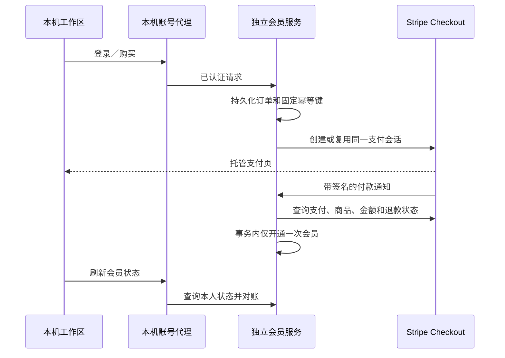

# 账号、会员与 Stripe 支付方案

日期：2026-10-08。状态：业务规则已由用户确认，代码与自动验证完成，Stripe 沙盒商品与启动检查通过，用户已测试付款；注册／登录性能已修复，完整人工验收待完成，见 [开发验收报告](MEMBERSHIP_TEST_REPORT.md)。

## 已确认的范围

- 保留本机下载、字幕、学习记录、问答及现有 DeepSeek Key 配置；新增独立账号和会员服务，不公开本机 API、记录、文件或浏览器 Cookie。
- 下载不限量。普通账号每天新生成摘要 3 次，会员 30 次，北京时间零点重置；失败释放额度，复用和导出不扣，重新生成扣一次。问答和字幕保持原行为。
- 一次支付人民币 19.90 元，获得付款确认后起算的 30 天会员，不自动续费；有效期内暂不再次购买。
- 邮箱和密码注册登录。按 2026-10-08 最新用户要求，注册及登录暂不要求邮箱验证，注册也不发送验证邮件；保留验证能力供后续启用，找回密码仍需要邮件。退款由运营者在 Stripe 后台人工操作，全额退款成功后撤销该笔权益。
- 商户账户地区为中国香港，已有 Stripe 账号，暂无公网域名。先完成本机开发和沙盒验收。
- 会员费只购买每日摘要额度，不包含 DeepSeek 模型费用；模型费用仍由本机 Key 持有人承担。
- 用户已接受：本机代码由用户控制，修改代码可以绕过本地能力限制。独立服务保障正常客户端的账号、付款与额度账本，不能据此声称本地许可证无法破解。

## 当前代码与接入方式

Vue 工作区目前没有账号；FastAPI 下载与学习接口运行在环回地址，学习 SQLite 没有用户字段。自动摘要在字幕任务完成后的后台线程接续，因此只限制网页按钮会漏掉自动摘要和直接 API 调用。

新增独立 FastAPI 会员服务，持有 Stripe 密钥、账号库、订单与额度账本；本机新增受原本机访问校验保护的账号代理。浏览器只持有 HttpOnly 本机会话，会员令牌与额度凭据留在独立本机数据库，视频资料不传给会员服务。摘要引擎在真正启动新摘要前预留额度，完成后结算，失败释放。自动接续捕获发起账号，不能误用后来登录的账号。

兼容性：未配置会员服务地址时保留个人本机模式；配置地址后，新摘要需要登录，读取、复用、导出、字幕、问答、下载不受账号门槛影响。会员模式服务不可用时，新摘要明确失败，不静默绕过额度。此开关用于保留原有个人工具，不是防破解措施。

## 支付约束

价格由服务端配置且固定为 `1990` 分、`cny`、数量 1；客户端不能指定金额、用户或 Price。使用一次性 Stripe Price 和托管 Checkout，不接触卡号或 CVC。首版不支持优惠券、免费试用、自动续费及任意套餐。

同一账号只有一个未解决订单：重复点击、多个标签页和服务重启复用订单／Checkout。Stripe 请求使用数据库中固定的幂等键和相同参数。创建结果未知时保留订单，重试同一键；超过 Stripe 幂等保存保障窗口后停止自动创建，要求人工对账。不能因为取消页面或请求超时就创建新订单。

Webhook 必须验证原始请求体签名，检查沙盒／正式模式；付款会话还要核对本系统订单、账号、商品、数量、金额和币种。通知 ID 唯一，会员授权绑定订单唯一；不同通知重复指向同一次付款也只开通一次。通知可能乱序，迟到的过期／失败事件不能覆盖已付款。成功跳转页面仅提示返回刷新，不凭 URL 开通权益。

已知支付会话过期前不另建订单。全额退款成功按 Stripe 当前付款状态撤销对应授权；部分退款不自动折算天数。争议暂停对应授权，最终胜诉可恢复未到期授权、败诉撤销。遇到不匹配、状态不明或超过自动重试窗口，返回可操作提示并保留审计记录。

## 账号、额度与数据

密码使用加盐 scrypt，数据库不保存明文密码；会话及邮箱操作令牌只保存摘要，验证／重置令牌有时限且单次使用。认证与邮箱操作限流；错误响应避免透露邮箱是否存在。重置密码撤销旧登录会话。正式环境需要 HTTPS、真实邮件发送和安全配置，开发邮件写入忽略目录供本机验收。

当前 `BILLING_REQUIRE_EMAIL_VERIFICATION=false`，新注册与已有未验证账号均可凭正确密码登录，不将邮箱标记为已验证；重复注册不会修改已有账号密码。将来改为 `true` 并重启会员服务后，未验证账号须验证才能登录，其旧会话也受验证门槛检查。前端按服务端配置隐藏或显示验证入口。邮件提示区分本机 `.eml` 与 SMTP 提交，SMTP 接受不代表实际到达收件箱；不通过公开接口暴露邮件、验证码、凭据或文件路径。

会员库使用 SQLite 事务与唯一约束，适用于首版单实例部署；扩展到多实例前迁移共享数据库。网络调用不在数据库写事务内执行。额度按账号、北京时间日期计算，会员每日 30 次包含当天已用的免费额度，非额外叠加 30 次；会员到期后恢复 3 次上限。

额度预留凭据绑定具体摘要任务；成功只结算一次，失败只释放一次。预留归属发起日期，跨午夜完成不扣第二天额度。任务期限为两小时，超时任务不得继续保存为成功；超过期限但尚未同步的预留仍占原日期额度，避免断网后在另一设备重复领取。当天及时完成的任务保留完成时间，结算断网后也能补记成功；新一天独立计算。本机保存结算待办并重试，重启时根据与摘要原子保存的任务状态恢复结果，中断任务释放预留。会员服务仅接收账号、任务标识与状态，不接收视频链接、字幕、摘要或模型 Key。这个完成证明来自受用户控制的本机客户端，仍受已确认的防绕过边界限制。

## 开发与验收

1. 独立账号服务、Stripe SDK 与持久化订单，签名和幂等测试。
2. 本机账号代理、工作区会员入口、直接注册登录、可选邮箱验证／邮件重置与支付状态刷新。
3. 手动／自动摘要额度接入及失败、重启、断网恢复；原下载与学习回归。
4. 本机模拟支付只用于离线回归，明确标注模拟；真实沙盒需要你配置测试密钥和 Price，通过 Stripe CLI 转发本机 Webhook，不需要公网域名。

必要测试覆盖并发购买、创建结果未知、重复／乱序通知、伪签名、金额及 Price 篡改、越权、密码重置、退款与争议、并发额度、摘要失败、自动接续、缓存、午夜和会员到期。真实 Stripe 沙盒与自动模拟结果分别记录，未实际执行的项目不能标为通过。

## 文档依据

本轮通过 Context7 获取 `/websites/stripe` 与 `/stripe/stripe-python` 官方文档，补充核对 [Checkout 履约](https://docs.stripe.com/checkout/fulfillment)、[幂等请求](https://docs.stripe.com/api/idempotent_requests)、[Webhook](https://docs.stripe.com/webhooks)、[CLI 本机转发](https://docs.stripe.com/cli/listen)、[测试支付](https://docs.stripe.com/testing)、[支持币种](https://docs.stripe.com/currencies) 和 [香港费率](https://stripe.com/en-hk/pricing)。SDK 固定为本次 PyPI 核对的稳定版 `16.0.0`，升级需要重新验证。

香港账户可展示支持的付款币种，但支付方式、结算币种和换汇费需要以你的账户配置为准。正式上线前核对账户已启用收款、银行结算、商品／业务合规、隐私和退款条款；本机沙盒通过不表示正式商户审核已通过。
